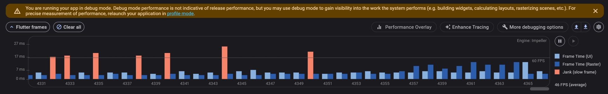
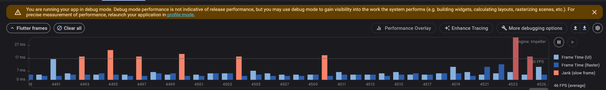
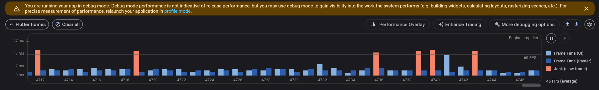
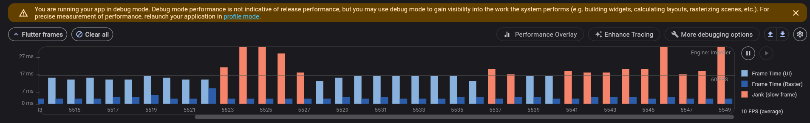

# Flutter Scroll Performance Lab

A Flutter demo app showcasing the performance characteristics of different scrollable widget types. It provides an interactive way to compare `ListView`, `SliverList`, `shrinkWrap`, and state management across scrollable items.

## 🚀 Features

* 📊 **Five Tabs** to test and compare:

  * Static `ListView`
  * `ListView.builder`
  * `SliverList` inside `CustomScrollView`
  * `ListView.builder` with `shrinkWrap: true`
  * `Lifecycle Example` to demonstrate state persistence with KeepAlive

* 🔍 Designed for profiling with **Flutter DevTools**

* 🧠 In-depth insight into list performance, widget lifecycle, and memory impact

## 📸 Screenshots

| Static ListView                            | ListView\.builder                            |
| ------------------------------------------ | -------------------------------------------- |
|  |  |

| SliverList                             | ShrinkWrap                                |
| -------------------------------------- | ----------------------------------------- |
|  |  |

## 📈 Performance Summary

| List Type         | FPS    | Build Cost | Memory Use | Notes                                          |
| ----------------- | ------ | ---------- | ---------- | ---------------------------------------------- |
| Static ListView   | 🔻 Low | 🔻 High    | 🔺 High    | Builds all widgets eagerly                     |
| ListView\.builder | ✅ High | ✅ Low      | ✅ Low      | Best for large, scrollable lists               |
| SliverList        | ✅ High | ✅ Low      | ✅ Low      | Equivalent to builder but more flexible layout |
| ShrinkWrap        | 🔻 Low | 🔻 High    | 🔺 High    | Avoid for large lists – forces eager build     |

## 🔬 How to Profile

1. Run app with: `flutter run --profile`
2. Launch **Flutter DevTools** → Performance tab
3. Tap each tab and scroll rapidly
4. Record session and inspect:

   * Frame rendering time
   * Memory and GC activity
   * Rebuild frequency

## 🧪 Lifecycle Tab Details

The `Lifecycle Example` tab demonstrates how list children behave when scrolled out of view:

* Items at even indexes are wrapped with `AutomaticKeepAliveClientMixin`
* Items at odd indexes are not kept alive
* You'll observe `initState` and `dispose` logs when scrolling
* Each item has its own counter state

## 📦 Getting Started

```bash
# Clone the repo
https://github.com/TalelBriki/flutter_scroll_performance_lab.git

cd flutter_scroll_performance_lab
flutter pub get
flutter run
```

## 📁 Folder Structure

```bash
lib/
├── main.dart
└── tabs/
    ├── static_list_view_tab.dart
    ├── builder_listview_tab.dart
    ├── sliver_list_tab.dart
    ├── shrink_wrap_tab.dart
    └── lifecycle_list_tab.dart
```

## 🧠 Learnings

* Prefer `ListView.builder` or `SliverList` for large dynamic content
* Avoid `shrinkWrap` unless the list is short or within a non-scrollable parent
* Use `KeepAlive`/`AutomaticKeepAliveClientMixin` carefully to persist state

## 🔗 Resources

* [Flutter DevTools](https://docs.flutter.dev/tools/devtools/performance)
* [SliverList](https://api.flutter.dev/flutter/widgets/SliverList-class.html)
* [KeepAlive docs](https://api.flutter.dev/flutter/widgets/AutomaticKeepAliveClientMixin-mixin.html)

## 📄 License

MIT License — free to use, fork, and contribute.
****
